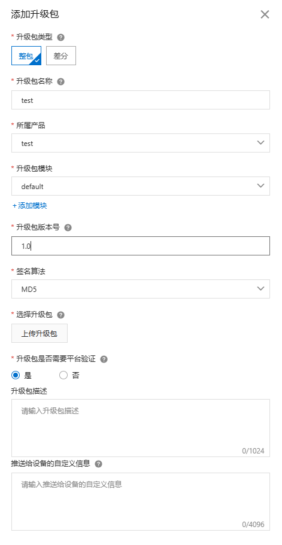
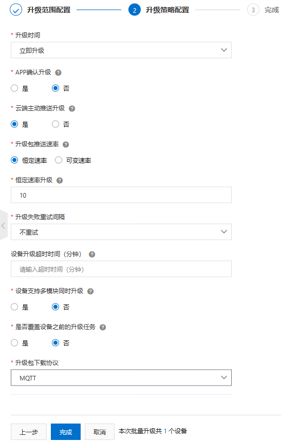
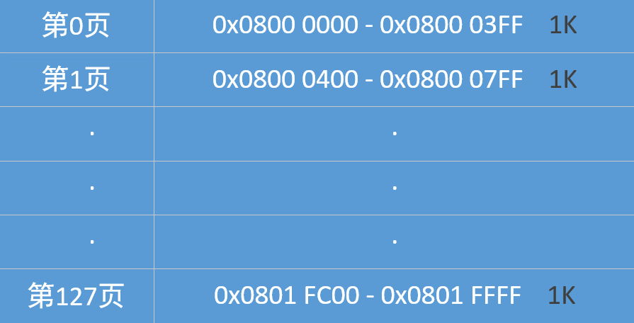
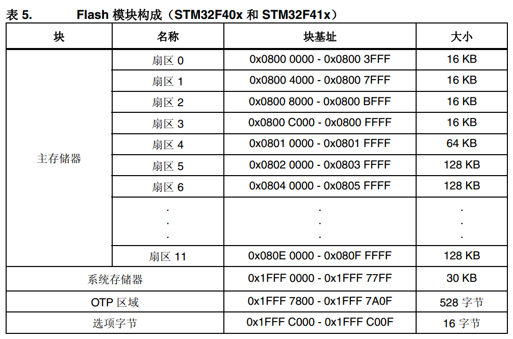

# STM32-Bootloader

自制的STM32-Bootloader，我取名为B-Boot。

可以使用Ymodem协议进行远程更新，或者使用4G模块配合阿里云完成OTA升级。

## 目录

- F103系列测试平台
    - Ymodem串口升级
    - DTU-4G升级
- F407系列测试平台
    - Ymodem串口升级
    - DTU-4G升级
- B-Boot怎么样工作的
    - 分区情况
- B-Boot怎么去使用
    - 更改分区
    - 烧录程序
    - 使用Xshell进行文件传输
- F1系列与F4系列的差异
- 多设备OTA升级
- 测试所使用的Bin文件
- Bootloader参考资料
- OTA结合MQTT参考教程

## F103系列测试平台

我所测试的板子为正点原子的战舰板和精英板(STM32F103ZET6)和IM板(STM32F103VCT6) 。

### Ymodem串口升级

调试器可以选择ST-Link或者Jlink都行，还需要将UART1和UART3连接到PC观察输出情况（Ymodem协议）。

<font color=red>Tips:</font>使用IM板时，因为JY901S占用了UART2，所以不能修改为UART2，~~当然可以使用一块没有焊接JY901S的板子~~。

### DTU-4G升级

我所使用的是有人云的DTU-DR152，接口为RS232，所以使用的是正点原子的战舰板(STM32F103ZET6)进行测试，UART1负责观察调试信息，UART3连接DTU-DR152，负责向阿里云发送报文，并从平台获取更新固件。

## F407系列测试平台

我所测试的板子为正点原子的探索者板(STM32F407ZGT6)。

### Ymodem串口升级

调试器可以选择ST-Link或者Jlink都行，还需要将UART1和UART3连接到PC观察输出情况（Ymodem协议）。

### DTU-4G升级

我所使用的是有人云的DTU-DR152，接口为RS232，所以使用的是正点原子的探索者板(STM32F407ZGT6))进行测试，UART1负责观察调试信息，UART3连接DTU-DR152，负责向阿里云发送报文，并从平台获取更新固件。

## B-Boot怎么样工作的

1. 先执行BootLoader程序, 先去检查APP2区有没有程序, 如果有就将App2区(备份区)的程序拷贝到App1区, 然后再跳转去执行App1的程序.
2. 然后执行App1程序, 因为BootLoader和App1这两个程序的向量表不一样, 所以跳转到App1之后第一步是先去更改程序的向量表. 然后再去执行其他的应用程序.
3. 在应用程序里面会加入程序升级的部分, 这部分主要工作是拿到升级程序, 然后将他们放到App2区(备份区), 以便下次启动的时候通过BootLoader更新App1的程序.


### 分区情况

目前F1工程中的分区为

```c
#define BootLoader_Size 		0x9000U		    	// BootLoader的大小 36K
#define Application_Size		0x1B000U	    	// 应用程序的大小 108K

#define Application_1_Addr		0x08009000U			// 应用程序1的首地址
#define Application_2_Addr		0x08024000U			// 应用程序2的首地址
```

这些宏在B-Boot-F1的bootloader.h，以及B-Boot-F1-APP的ymodem.h中，两边需要同时更改。根据实际情况来就行。

---

目前F4工程中的分区为

```c
#define BootLoader_Size 		0x20000U			// BootLoader的大小 128K
#define Application_Size		0x60000U			// 应用程序的大小 384K

#define Application_1_Addr		0x08020000U			// 应用程序1的首地址
#define Application_2_Addr		0x08080000U			// 应用程序2的首地址
```

这些宏在B-Boot-F4的bootloader.h，以及B-Boot-F4-APP的ymodem.h中，两边需要同时更改。根据实际情况来就行。

## B-Boot怎么去使用

下面主要讲解是F1的使用，F4也是类似的。

### 更改分区

首先在两个工程中都更改分区宏定义，如果Bootloader不变就可以不改。

然后在Keil-MDK中Options for target中，更改IROM1的Start和Size。

**对于Bootloader而言**，需要指定Start为0x8000000，Size为BootLoader_Size。DEBUG中的烧录配置也要进行更改，擦除方式选择Erase Sectors。


**对于APP而言**，需要指定Start为Application_1_Addr，Size为Application_Size。擦除方式选择Erase Sectors。


### 烧录程序

首先烧录B-boot。烧录完成后会自动运行，如果没有APP1的程序，会打印`Boot Error No Application`

再烧录APP程序。烧录完成后串口1会打印`B-Boot's Application`，串口2会一直输出'C'字符，代表等待接收.bin文件。


### 使用Xshell进行文件传输

**首先在main.c中将`#define USE_YMODEM        //使用串口进行升级`取消注释**

串口1进行调试信息的打印，串口3进行YModem升级。

在Xshell界面中右键传输，选择YModem协议传输，将.bin文件发送到板子上完成更新。

注意Ymodem的分组大小应该为128bytes（Ymodem），不要选择1024bytes（Ymodem-1K）。

如果一直卡在程序升级的地方，需要将整个flash重新擦除，再烧写一次Bootloader和App。

### 使用阿里云远程OTA

**首先在main.c中将`#define USE_DTU_4G      //使用DTU4G模块进行升级`取消注释**

1. 要先连接上阿里云，代码中的一些设备配置都需要按照实际情况修改，例如clientId、username、passwd、mqttHostUrl、port

2. 需要在OTA升级中添加升级包



3. 通过批量升级完成固件包的下发，这里要选择使用MQTT协议



## F1系列与F4系列的差异

F1与F4的代码主要区别在于flash的擦除，F1对页进行操作，F4对扇区进行操作。

F4以扇区Sector为单位，所以使用flash擦除函数的时候要格外小心，防止擦除其他分区。

在程序中最需要注意的是在使用Flash_Erase_Sector()函数时，第二个参数需要减1，没有这个减1可能会擦除下一个分区。例如：Flash_Erase_Sector(des_addr, des_addr + Application_Size - 1);



<center><p>F1系列Flash128K分布图</p></center>



<center><p>F4系列Flash分布图</p></center>

## 多设备OTA升级

之前都是一个设备的升级，在代码多将设备名固定。但实际情况都是很多个设备一起升级。

将报文的ProductKey和DeviceName都使用%s替换，采用sprintf保存在temp中，这样解决了多设备报文不一样的问题。

所以我打算在APP2结束之后的第一个word中加入标记，例如设备名为Dxxx，我将此word写入1代表D001设备。

应用程序需要在启动的时候去读取对应位置上的值，通过switch方式给设备信息结构体的各个成员赋值。这样只需要一套应用程序就可以满足所有的设备升级。麻烦在于需要在switch中写入所有设备的信息。

需要注意的是，在标记的时候，需要先对flash进行擦除，不然无法写入。F1由于使用页擦除，不容易损坏bootloader，可以将标记放入；F4使用扇区擦除，需要注意扇区的范围，不建议将标记放到bootloader中。

## 测试所使用的Bin文件

在目录下有一个TestBin的文件夹，里面存放了测试所使用的Bin文件。

例如STM32F1-0x9000.bin，代表STM32F1系列，bootloader大小为0x9000。

B-Boot-F4-APPV0.2.bin为V0.2版本，B-Boot-F4-APPV0.3.bin为V0.3版本。

## Bootloader参考教程

[STM32单片机bootloader扫盲_stm32 bootloader_不咸不要钱的博客-CSDN博客](https://blog.csdn.net/weixin_42378319/article/details/120896348)

[ESA2GJK1DH1K升级篇: IAP详解 - 广源时代 - 博客园 (cnblogs.com)](https://www.cnblogs.com/yangfengwu/p/11639176.html)

[STM32CubeMx开发之路—在线升级OTA_stm32ota升级例程_iot 小胡的博客-CSDN博客](https://blog.csdn.net/weixin_41294615/article/details/104669766?spm=1001.2014.3001.5502)

[【STM32OTA】两节课4G模组升级STM32学不会直播吃......_哔哩哔哩_bilibili](https://www.bilibili.com/video/BV14K4y147x3/?spm_id_from=333.337.search-card.all.click&vd_source=6057f993f0b528310b130bbca1e824fa)

[[笔记\]STM32基于HAL编写Bootloader+App程序结构_stm32 hal hid bootloarder_Unit丶的博客-CSDN博客](https://blog.csdn.net/qq_33591039/article/details/121562204)

## OTA结合MQTT参考教程

[001-使用阿里云物联网平台 OTA 远程升级STM32程序-基于ESP8266 - 广源时代 - 博客园 (cnblogs.com)](https://www.cnblogs.com/yangfengwu/p/13591513.html)

[stm32 esp8266 ota升级-自建mqtt和文件服务器全量升级_esp8266 stm32 ota_hbwsmile的博客-CSDN博客](https://blog.csdn.net/a554521655/article/details/128492112)

[STM32&4G模组实现OTA升级_stm32 ota升级 github_linggan17的博客-CSDN博客](https://blog.csdn.net/qq_42722691/article/details/113247862)

[001-STM32+Air724UG(4G模组)基本控制篇(阿里云物联网平台)-使用MQTT接入阿里云物联网平台_杨奉武的博客-CSDN博客](https://blog.csdn.net/qq_14941407/article/details/115594411)

视频教程首推B站超子说物联网，里面都是关于物联网的视频