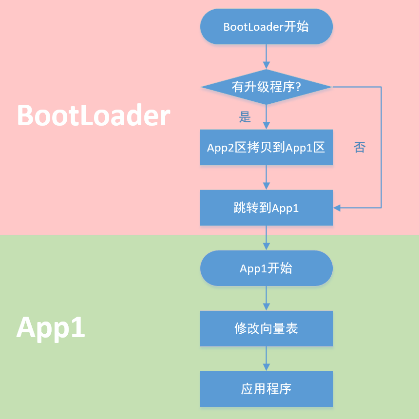
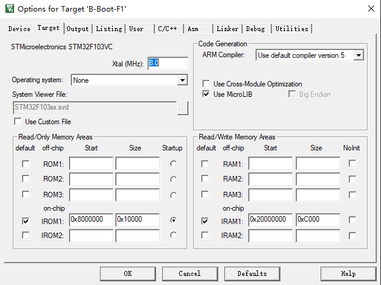
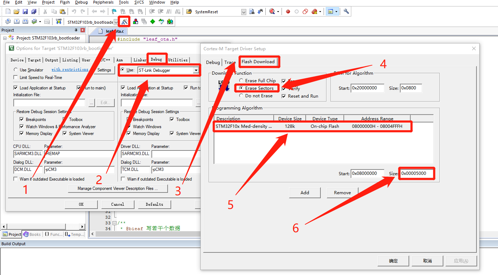
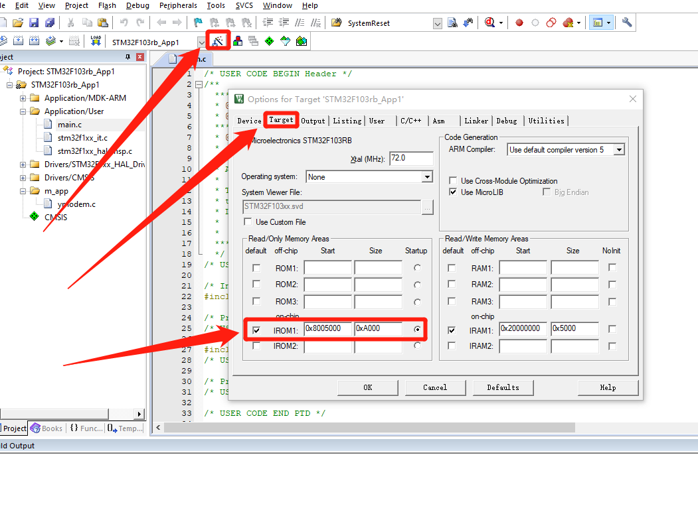
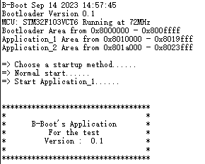

# STM32-Bootloader

自制的STM32-Bootloader，我取名为B-Boot。

使用Ymodem协议进行远程更新，后续会追加4G模块的OTA升级。

## 目录

- F103系列
- ~~F407系列~~
- B-Boot怎么样工作的
    - 分区情况
- B-Boot怎么去使用
    - 更改分区
    - 烧录程序
    - 使用Xshell进行文件传输
- 参考资料

## F103系列

我所测试的板子为正点原子的精英板(STM32F103ZET6)和IM板(STM32F103VCT6) 。

<font color=red>Tips:</font>使用IM板时，因为JY901S占用了UART2，所以需要使用除UART2之外的带DMA功能串口，比如UART3、UART4，~~当然可以使用一块没有焊接JY901S的板子~~。

调试器可以选择ST-Link或者Jlink都行，还需要将UART1和UART2连接到PC观察输出情况。

## B-Boot怎么样工作的

1. 先执行BootLoader程序, 先去检查APP2区有没有程序, 如果有就将App2区(备份区)的程序拷贝到App1区, 然后再跳转去执行App1的程序.
2. 然后执行App1程序, 因为BootLoader和App1这两个程序的向量表不一样, 所以跳转到App1之后第一步是先去更改程序的向量表. 然后再去执行其他的应用程序.
3. 在应用程序里面会加入程序升级的部分, 这部分主要工作是拿到升级程序, 然后将他们放到App2区(备份区), 以便下次启动的时候通过BootLoader更新App1的程序.



### 分区情况

目前工程中的分区为

```c
#define BootLoader_Size 		0x10000U			// BootLoader的大小 40K
#define Application_Size		0xA000U		        // 应用程序的大小 40K

#define Application_1_Addr		0x08010000U			// 应用程序1的首地址
#define Application_2_Addr		0x0801A000U			// 应用程序2的首地址
```

这些宏在B-Boot-F1的bootloader.h，以及B-Boot-F1-APP的ymodem.h中，两边需要同时更改。根据实际情况来就行。

## B-Boot怎么去使用

### 更改分区

首先在两个工程中都更改分区宏定义，如果Bootloader不变就可以不改。

然后在Keil-MDK中Options for target中，更改IROM1的Start和Size。

**对于Bootloader而言**，需要指定Start为0x8000000，Size为BootLoader_Size。DEBUG中的烧录配置也要进行更改，擦除方式选择Erase Sectors。

    



**对于APP而言**，需要指定Start为Application_1_Addr，Size为Application_Size。擦除方式选择Erase Sectors。



### 烧录程序

首先烧录B-boot。烧录完成后会自动运行，如果没有APP1的程序，会打印`Boot Error No Application`

再烧录APP程序。烧录完成后串口1会打印`B-Boot's Application`，串口2会一直输出'C'字符，代表等待接收.bin文件。



### 使用Xshell进行文件传输

串口1进行调试信息的打印, 串口2进行YModem升级。

在Xshell界面中右键传输，选择YModem协议传输，将.bin文件发送到板子上完成更新。

如果一直卡在程序升级的地方，需要将整个flash重新擦除再烧写一次。

## 参考教程

[STM32单片机bootloader扫盲_stm32 bootloader_不咸不要钱的博客-CSDN博客](https://blog.csdn.net/weixin_42378319/article/details/120896348)

[ESA2GJK1DH1K升级篇: IAP详解 - 广源时代 - 博客园 (cnblogs.com)](https://www.cnblogs.com/yangfengwu/p/11639176.html)

[STM32CubeMx开发之路—在线升级OTA_stm32ota升级例程_iot 小胡的博客-CSDN博客](https://blog.csdn.net/weixin_41294615/article/details/104669766?spm=1001.2014.3001.5502)

[【STM32OTA】两节课4G模组升级STM32学不会直播吃......_哔哩哔哩_bilibili](https://www.bilibili.com/video/BV14K4y147x3/?spm_id_from=333.337.search-card.all.click&vd_source=6057f993f0b528310b130bbca1e824fa)

[[笔记\]STM32基于HAL编写Bootloader+App程序结构_stm32 hal hid bootloarder_Unit丶的博客-CSDN博客](https://blog.csdn.net/qq_33591039/article/details/121562204)